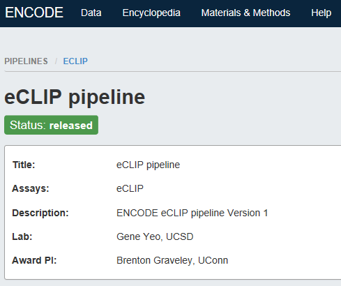
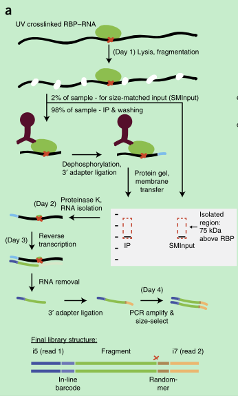
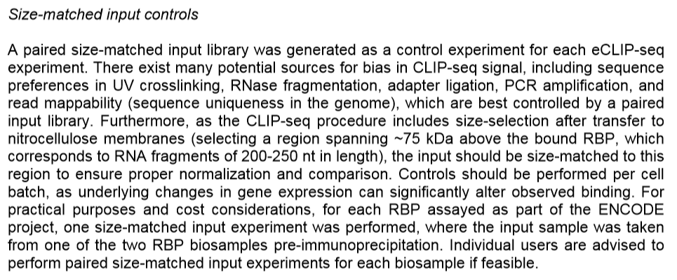
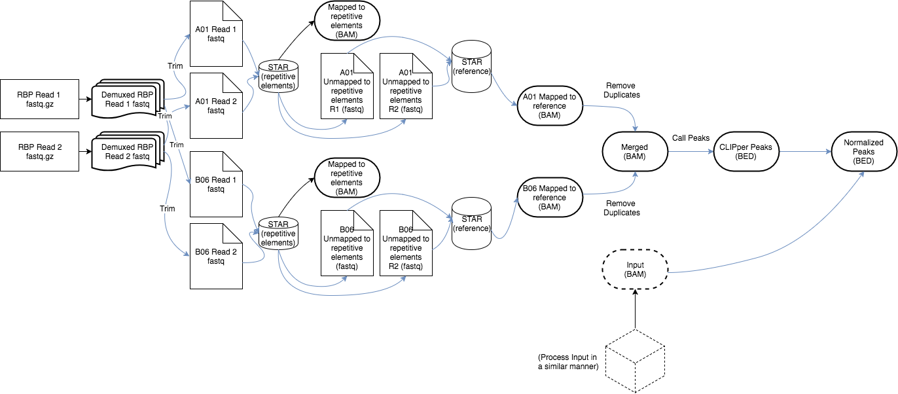
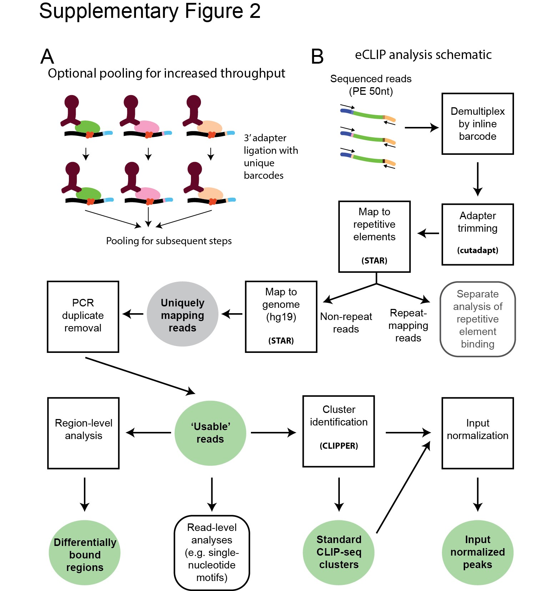

# eCLIP
## Summary on eCLIP pipeline by QuSusu

Update at 2018/05/17

---
- 会持续性地对eCLIP的内容补充，目前主要写一篇文献的summary介绍一些背景知识，以及对pipeline目前的掌握情况。
ps：其实我对RNA相关的东西了解超级少，硬着头皮看了这个文献，理解的还不够深入，先写下自己目前的理解。
## 先给自己科普下简单的知识、名词：
- 转录调控：蛋白质对DNA
- 转录后调控：蛋白质对RNA
- 转录水平的实验相对容易做，_**转录后的研究对实验技术要求高**_。
- RNA-binding proteins，RBPs：RNA结合蛋白（简称RBPs），RBPs能与RNA分子相互作用，是一类伴随RNA的调控代谢过程，与RNA结合的蛋白质的总称。RBP伴随RNA生命始终，可以不夸张的说：没有RBP，RNA寸步难行。其主要作用是介导RNA的成熟、转运、定位和翻译；一个RBP可能存在多种靶标RNA；且其表达缺陷会造成多种疾病。
	- 在哪里可以找到RBP对应的数据：
		- [RBP database](http://rbpdb.ccbr.utoronto.ca/)：但我看了一下最近一次的更新数据也是2012年了，估计没有人维护了。
		- [ENCODE](https://www.encodeproject.org/eclip/)：推荐这个。

- RNA ligase: RNA连接酶

- CLIP：crosslinking and immunoprecipitation，核糖核苷交联和免疫共沉淀，一种常用的用于研究RBP与RNA分子之间的作用的实验方法。
- CLIP-seq：即紫外交联免疫沉淀结合高通量测序(crosslinking immunprecipitation and high-throughput sequencing)，是一项在全基因组水平揭示RNA分子与RNA结合蛋白相互作用的革命性技术。其主要原理是基于RNA分子与RNA结合蛋白在紫外照射下发生耦联，以RNA结合蛋白的特异性抗体将RNA-蛋白质复合体沉淀之后，回收其中的RNA片段，经添加接头、RT-PCR等步骤，对这些分子进行高通量测序，再经生物信息学的分析和处理、总结，挖掘出其特定规律，从而深入揭示RNA结合蛋白与RNA分子的调控作用及其对生命的意义。
- eCLIP：enhanced CLIP ，一种相对于CLIP“升级的”方法，据说在鉴定RBP结合位点时有更好的效果。

---
## Robust transcriptome-wide discovery of RNA-binding protein binding sites with enhanced CLIP (eCLIP)

	The eCLIP method and processing pipeline were developed by the laboratory of Gene Yeo at the University of California, San Diego.据说这个Gene Yeo是个学术方面超厉害的人~
### Why eCLIP occurs?
目前通过PAR-CLIP，iCLIP等方法寻找RBP的结合位点存在技术上的挑战——实验失败率较高、建库测序的多样性低等问题，因此有了现在的enhanced CLIP的产生。
### 文章主要有几个目的：
1.证明eCLIP这种方法相对于其他而言确实识别RBP结合位点的效果更好；

2.给了对应的详细数据分析流程；但目前据主管说，虽然有release版本但也是正在开发中的pipeline，bug较多，正在测试中；

### 解读实验流程特别之处
和传统的CLIP相比，或者说更直接地和传统的RNAseq相比，因为我们都没有直接接触过实验，所以对文章里的整个主要流程图就非常蒙，看不懂在干嘛，所以大部分精力放在研究整个图到底怎么回事，因为只有了解了实验原理才知道如何分析。

### 图解：
- UV的方式使得RBP和RNA进行耦联、紧密结合；
- 裂解RNA片段；
- 对于裂解后的样本，分成2份（**这里也是我最困惑的地方，为什么要把sample分成两份呢？而且两份后续的实验操作还不同——下面会解释**）：
	- 2% of sample——for size-matched imput (SMInput)
	- 98% of sample——IP  & washing

- 对两份样本分开进行不同的处理：
	- **98% of sample：** 加可以和RBP作用的抗体，然后对RNA片段去磷酸化，并且在3‘端结合“in-line-barcoded” RNA adapter。跑蛋白凝胶（这样在蛋白胶上就可以看到大概有75KDa大小的条带，RNA大小大概是220nt，可以忽略，证明拿到的这部分确实是有RBP结合的部分）、硝酸纤维素膜过滤后，然后再用蛋白酶把蛋白消化掉分离得到RNA，对得到的RNA进一步“加工”用于后续的双端高通量测序。将RNA进一步制备成配对末端高通量测序文库，其中读数1以串联条形码开始，读数2以随机序列开始（在3'DNA衔接子连接过程中添加），随后是对应于原始RNA片段的5'末端（其通常标记交联位点处的逆转录酶终止（红色X））。
这个“加工”对应的原文是（没太理解）：

			RNA is further prepared into paired-end high-throughput sequencing libraries, where read 1 begins with the in-line barcode and read 2 begins with a random-mer sequence (added during the 3′ DNA adapter ligation) followed by a sequence corresponding to the 5′ end of the original RNA fragment (which often marks reverse transcriptase termination at the crosslink site (red X)). 

- **2% of sample：** 用于SMInput，即size-matched input control，是为了做对照去除一些类似系统误差的作用。 This  ‘size-matched  input  control’  (SMInput)  serves  as a  crucial  control  for  nonspecific background  signal  in  the  identical size range on the membrane as well as any inherent biases in ligations, RT–PCR, gel migration and transfer steps. 

ENCODE Guidelines for eCLIP-seq Experiments文档中有一段关于SMInput的描述觉得更清晰些，如下图：

---

# Analysis Pipeline
实验部分就先看到这、写到这里，其实还是有疑问的，带着疑问后面会研究下分析的pipeline：[YeoLab-eCLIP](https://github.com/YeoLab/eclip)

关于分析的方法、pipeline，又看了下文章中关于ONLINE METHODS这部分的介绍，其实描述的还算详细的，所以在考虑是不是从文章的Supplementary Protocol 2.中的code入手，觉得github上的应该还在开发中，复现的话估计原文中的比较好实现吧。

然而！！！特别坑的是今天发现文献中给的[Code availability路径](https://github.com/gpratt/gatk/releases/tag/2.3.2),，根本找不到对应的内容，八竿子打不着，所以只能用github上的内容了。

## Common Workflow Language (CWL)
因为整个eCLIP是基于Common Workflow Language (CWL)的，所以需要先了解一下这个语言:

***Introduction from the website:*** The Common Workflow Language (CWL) is a specification for describing analysis workflows and tools in a way that makes them portable and scalable across a variety of software and hardware environments, from workstations to cluster, cloud, and high performance computing (HPC) environments. CWL is designed to meet the needs of data-intensive science, such as Bioinformatics, Medical Imaging, Astronomy, Physics, and Chemistry. 简单说就是一个通用工作流程语言，用于规范地描述分析工作流程和工具。

- [CWL-GitHub](https://github.com/common-workflow-language/cwltool)
- [CWL-user guide](https://www.commonwl.org/#Implementations)

## eclip 0.2.1a release version
目前GitHub上的eclip有3个release版本，我们server上目前是基于最新发布的0.2.1a版。我使用之前主管都把cwl、conda（其实我到现在还是不知道conda是啥）等这些安装好了，所以我只需要配置一下环境变量就可以用了。
***ps: 其实蛮希望这些全部根据文档自己安装一遍，毕竟短板是在安装上，如果……有机会……试试***

### 配置环境变量：

	#eCLIP related environments (我把和他不一样的环境变量都加进来了，其实有些乱，有些也有可能不需要，后续再优化吧)
	PATH=$PATH:/Bioinfo/ScientificResearchService/project/project3_eclip_20180314/bin/eclip-0.2.1a/cwl/
	PATH=$PATH:/Bioinfo/ScientificResearchService/project/project3_eclip_20180314/bin/eclip-0.2.1a/wf
	PATH=$PATH:/Bioinfo/ScientificResearchService/project/project3_eclip_20180314/bin/eclip-0.2.1a/bin/
	PATH=$PATH:/Bioinfo/ScientificResearchService/bin/anaconda/anaconda3-5.1.0/envs/clip-seq/bin
	PATH=$PATH:/Bioinfo/ScientificResearchService/project/project3_eclip_20180314/bin/eclip-0.2.1a/bin/eclipdemux/bin
	PATH=$PATH:/Bioinfo/ScientificResearchService/project/project3_eclip_20180314/bin/eclip-0.2.1a/bin/makebigwigfiles/makebigwigfiles
	PATH=/Bioinfo/ScientificResearchService/bin/anaconda/anaconda3-5.1.0/bin:$PATH
	
据主管说他把conda安在了/Bioinfo/ScientificResearchService/bin/anaconda/anaconda3-5.1.0/里，所以也得加上这个路径。
	
### 虚拟环境设置（？maybe 不够准确，后续update）
cat init.sh

	source activate clip-seq;
	export PATH=${PWD}/bin/:$PATH;
	export PATH=${PWD}/cwl/:$PATH;
	# export PATH=${PWD}/members:$PATH;
	export PATH=${PWD}/wf:$PATH;
	# export PATH=${PWD}/members/bin/:$PATH;
	# export PATH=${PWD}/metadata:$PATH;
	### required by toil source ###
	### use development branch of toil, latest stable has some bugs with torque resource alloc ###
	cd ${PWD}/bin;
	cd toil;
	cd ../;
	cd eclipdemux;
	export PATH=$PATH:${PWD}/bin
	cd ..;
	cd gscripts;
	cd ..;
	cd clipper;
	cd ..;
	cd makebigwigfiles;
	export PATH=$PATH:${PWD}/makebigwigfiles
	cd ..;

source init.sh

### run an example
.yaml文件是cwl程序的参数执行文件
在虚拟环境中运行程序：

	source activate clip-seq

	$demux_pe.cwl /Bioinfo/ScientificResearchService/project/project3_eclip_20180314/bin/eclip-0.2.1a/tests/01_demux/demux.yaml

***可是依然对整个流程充满了疑惑：***
1.按照文章附件给的文档说明，merge的应该是两个技术重复：Merges the two technical replicates for further downstream analysis.但按照GitHub上的图所示又好像是一个sample的2个reads：

2.以及，按照文章附件给的文档说明：To each sample, add 2.5 μl of each of two different barcoded RNA adapters to each sample.
Acceptable RNA adapter pairs:
 A01 + B06
 C01 + D08
 A03 + G07
 A04 + F05
 X1-A + X1-B
 X2-A + X2-B
还是上面那个图，如果最开始的read1和read2是指的一个sample的两条reads，那后面为什么要岔开交差处理呢？不懂。

3.再看这个图：

(a) At the 3′ RNA adapter ligation step in eCLIP, the RNA adapter includes a barcode sequence, enabling pooling of multiple experiments before the protein gel electrophoresis step. Note that pooled samples must have identical desired cut size on the nitrocellulose membrane, and should have a similar number of RNA molecules (to avoid over- or under-sequencing of individual experiments within the pooled sample). (b) Schematic of eCLIP computational analysis pipeline. Squares indicate processing steps, with processing output used for downstream analyses indicated as filled green circles. Software packages used are indicated in bold.

Supplementary Protocol 2里提供了Yeo Lab Custom Script Versions，随便点进去看了一个就找到了[原文当年分析用的全部代码的链接](https://github.com/YeoLab/gscripts/releases)，这个不是基于CWL的，估计重复起来更容易。

***整体感觉就是好多东西我和主管现在都在猜，但已经有了一些进展了，然后感慨了下Yeo真是牛人，啊哈哈哈……未完待续***

