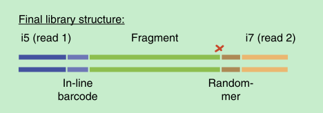

# eCLIP
## Study notes on eCLIP pipeline by QuSusu
---
应该会持续性地对eCLIP的内容补充，今天主要写一篇文献的summary。其实我对RNA相关的东西了解超级少，硬着头皮看了这个文献，理解的还不够深入，先写下自己目前的理解。
## 先给自己科普下简单的知识、名词：
- 转录调控：蛋白质对DNA
- 转录后调控：蛋白质对RNA
- 转录水平的实验相对容易做，转录后的研究对实验技术要求高。
- RNA-binding protein，RBP：有一类RNA结合蛋白（简称RBP），它们会结合RNA，调控RNA加工。
	- 在哪里可以找到RBP对应的数据：
		- [RBP database](http://rbpdb.ccbr.utoronto.ca/)：但我看了一下最近一次的更新数据也是2012年了，估计没有人维护了。
		- [ENCODE](https://www.encodeproject.org/eclip/)：推荐这个。
- CLIP：crosslinking and immunoprecipitation，一种实验方法，用于鉴定RBP的结合位点。
- eCLIP：enhanced CLIP ，一种相对于CLIP“升级的”实验方法，据说在鉴定RBP结合位点时有更好的效果。

---
## Robust transcriptome-wide discovery of RNA-binding protein binding sites with enhanced CLIP (eCLIP)

	The eCLIP method and processing pipeline were developed by the laboratory of Gene Yeo at the University of California, San Diego.据说这个Gene Yeo是个学术方面超厉害的人~
### Why eCLIP occurs?
目前通过PAR-CLIP，iCLIP等方法寻找RBP的结合位点存在技术上的挑战——实验失败率较高、建库测序的多样性低等问题，因此有了现在的enhanced CLIP的产生。
### 文章主要有几个目的：
1.证明eCLIP这种方法相对于其他而言确实识别RBP结合位点的效果更好；

2.给了对应的详细数据分析流程；但目前据主管说，虽然有release版本但也是正在开发中的pipeline，bug较多，正在测试中；

### 解读实验流程特别之处
和传统的CLIP相比，或者说更直接地和传统的RNAseq相比，因为我们都没有直接接触过实验，所以对文章里的整个主要流程图就非常蒙，看不懂在干嘛，所以大部分精力放在研究整个图到底怎么回事，因为只有了解了实验原理才知道如何分析。

### 图解：
- UV的方式使得RBP和RNA进行紧密结合；
- 裂解RNA片段；
- 对于裂解后的样本，分成2份（**这里也是我最困惑的地方，为什么要把sample分成两份呢？而且两份后续的实验操作还不同——下面会解释**）：
	- 2% of sample——for size-matched imput (SMInput)
	- 98% of sample——IP  & washing

- 对两份样本分开进行不同的处理：
	- **98% of sample：** 加可以和RBP作用的抗体，然后对RNA片段去磷酸化，并且在3‘端结合“in-line-barcoded” RNA adapter。跑蛋白凝胶（这样在蛋白胶上就可以看到大概有75KDa大小的条带，RNA大小大概是220nt，可以忽略，证明拿到的这部分确实是有RBP结合的部分）、硝酸纤维素膜过滤后，然后再用蛋白酶把蛋白消化掉分离得到RNA，对得到的RNA进一步“加工”用于后续的双端高通量测序。将RNA进一步制备成配对末端高通量测序文库，其中读数1以串联条形码开始，读数2以随机序列开始（在3'DNA衔接子连接过程中添加），随后是对应于原始RNA片段的5'末端（其通常标记交联位点处的逆转录酶终止（红色X））。
这个“加工”对应的原文是（没太理解）：

			RNA is further prepared into paired-end high-throughput sequencing libraries, where read 1 begins with the in-line barcode and read 2 begins with a random-mer sequence (added during the 3′ DNA adapter ligation) followed by a sequence corresponding to the 5′ end of the original RNA fragment (which often marks reverse transcriptase termination at the crosslink site (red X)). 

- **2% of sample：** 用于SMInput，即size-matched input control，是为了做对照去除一些类似系统误差的作用。 This  ‘size-matched  input  control’  (SMInput)  serves  as a  crucial  control  for  nonspecific background  signal  in  the  identical size range on the membrane as well as any inherent biases in ligations, RT–PCR, gel migration and transfer steps. 

---

### Analysis Pipeline
实验部分就先看到这、写到这里，其实还是有疑问的，带着疑问后面会研究下分析的pipeline：[YeoLab-eCLIP](https://github.com/YeoLab/eclip)

***未完待续***

